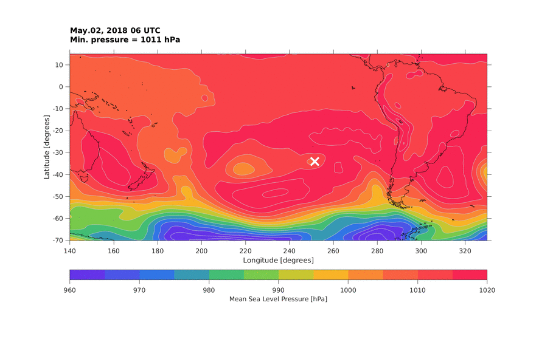
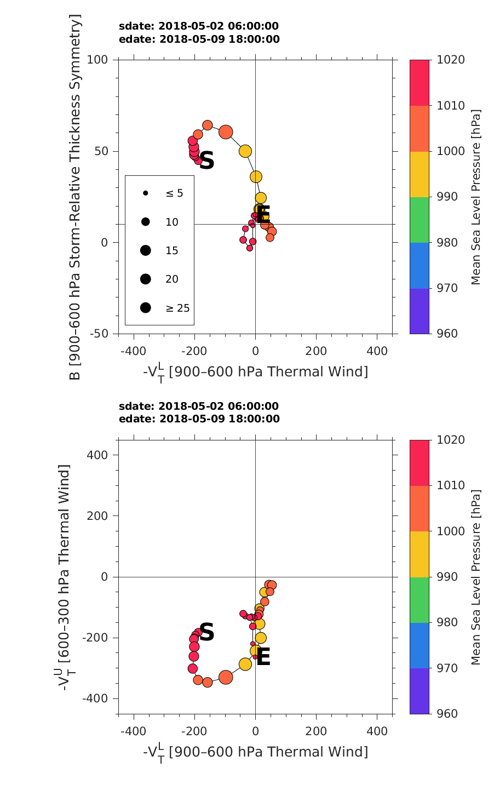

# Cyclone Phase Space (CPS)

This repository contains a set of scripts to compute the **Cyclone Phase Space (CPS)** as defined by [Hart (2003)](https://journals.ametsoc.org/view/journals/mwre/131/4/1520-0493_2003_131_0585_acpsdf_2.0.co_2.xml).

The calculated parameters are:

1. **B** : The storm-motion-relative 900–600 hPa thickness gradient across the cyclone.
2. **–V<sub>T</sub><sup>L</sup>** : The magnitude of the cyclone’s lower-tropospheric thermal wind. This is measured as the vertical gradient of geopotential height between 900 and 600 hPa, providing a measure of cyclone strength.
3. **–V<sub>T</sub><sup>U</sup>** : Same as (2), but calculated for the upper troposphere (600–300 hPa). This provides a measure of the cyclone phase (cold-core vs warm-core) in the upper levels. This parameter helps distinguish deep warm-core cyclones (e.g., tropical cyclones) from shallow warm-core systems (e.g., warm seclusions or subtropical cyclones).

These parameters are typically visualized in two diagrams:

- **–V<sub>T</sub><sup>L</sup>** vs **B**
- **–V<sub>T</sub><sup>L</sup>** vs **–V<sub>T</sub><sup>U</sup>**

These diagrams are commonly used to classify cyclone types based on their structural characteristics. For detailed information on interpretation and classification, refer to the original paper linked above.

Further background and examples of analyses and experimental cyclone forecasts can be found on the [CPS project page](http://moe.met.fsu.edu/cyclonephase/), maintained by Robert Hart and Jenni Evans.

---

## Folder Structure

The repository is organized as follows:

```
├── input/filelists    : Lists with NetCDF file paths (HGT/MSLP)
├── input/tracks       : Cyclone track files
├── functions          : Functions used in the analysis
├── output/track_gifs  : GIF animations of cyclone tracks
├── output/phase_plots : CPS phase diagrams
└── output/text_files  : Computed CPS parameters saved as .txt files
```

**Important:**  
Before running the scripts, make a backup of the following folders:

- `output/text_files`
- `output/phase_plots`
- `output/track_gifs`

These folders will be overwritten with the new results each time the code is executed.

## Processing Steps

### a) Preliminary

1. You need a text file with the trajectories of the cyclones in the following format, saved in the folder `input/tracks`:

```
start 31 2018 5 2 6 739
251.500000 -34.000000 9.212564 1011.180000 2018.000000 5.000000 2.000000 6.000000
253.750000 -34.000000 8.954327 1010.090000 2018.000000 5.000000 2.000000 12.000000
256.750000 -34.000000 9.361092 1012.140000 2018.000000 5.000000 2.000000 18.000000
259.750000 -34.000000 11.026744 1011.620000 2018.000000 5.000000 3.000000 0.000000
262.750000 -33.250000 13.794192 1012.500000 2018.000000 5.000000 3.000000 6.000000
266.500000 -33.250000 13.530063 1011.550000 2018.000000 5.000000 3.000000 12.000000
268.750000 -33.250000 12.591286 1010.920000 2018.000000 5.000000 3.000000 18.000000
270.250000 -33.250000 12.838909 1007.400000 2018.000000 5.000000 4.000000 0.000000
272.500000 -33.250000 13.683238 1004.770000 2018.000000 5.000000 4.000000 6.000000
274.000000 -34.000000 25.291590 1000.420000 2018.000000 5.000000 4.000000 12.000000
274.750000 -34.000000 20.357216 994.930000 2018.000000 5.000000 4.000000 18.000000
275.500000 -34.000000 18.626408 991.870000 2018.000000 5.000000 5.000000 0.000000
277.000000 -34.000000 16.942410 992.600000 2018.000000 5.000000 5.000000 6.000000
277.750000 -34.750000 16.497339 990.740000 2018.000000 5.000000 5.000000 12.000000
278.500000 -35.500000 12.739173 992.260000 2018.000000 5.000000 5.000000 18.000000
278.500000 -36.250000 12.443255 993.570000 2018.000000 5.000000 6.000000 0.000000
278.500000 -36.250000 11.094893 996.110000 2018.000000 5.000000 6.000000 6.000000
278.500000 -36.250000 11.096031 997.580000 2018.000000 5.000000 6.000000 12.000000
278.500000 -35.500000 9.202775 1001.670000 2018.000000 5.000000 6.000000 18.000000
278.500000 -34.750000 10.071292 1003.550000 2018.000000 5.000000 7.000000 0.000000
279.250000 -34.000000 7.881681 1005.960000 2018.000000 5.000000 7.000000 6.000000
280.000000 -32.500000 10.211308 1007.660000 2018.000000 5.000000 7.000000 12.000000
280.000000 -32.500000 8.217718 1009.230000 2018.000000 5.000000 7.000000 18.000000
280.750000 -31.750000 6.602517 1009.470000 2018.000000 5.000000 8.000000 0.000000
281.500000 -31.000000 6.778980 1009.110000 2018.000000 5.000000 8.000000 6.000000
281.500000 -31.000000 6.408419 1009.230000 2018.000000 5.000000 8.000000 12.000000
281.500000 -31.000000 7.901086 1010.420000 2018.000000 5.000000 8.000000 18.000000
281.500000 -30.250000 6.408975 1010.910000 2018.000000 5.000000 9.000000 0.000000
281.500000 -30.250000 7.505793 1012.710000 2018.000000 5.000000 9.000000 6.000000
282.250000 -29.500000 4.894144 1013.430000 2018.000000 5.000000 9.000000 12.000000
282.250000 -29.500000 4.994496 1014.620000 2018.000000 5.000000 9.000000 18.000000
```

Here, the header is:

```
start : start trajectory
31    : number of observations
2018  : start year
5     : start month
2     : start day
6     : start hour
739   : trajectory number
```

And the columns are:

```
Longitude
Latitude
Magnitude of the wind
Mean Sea Level Pressure
Year
Month
Day
Hour
```

2. You also need a set of gridded data in NetCDF format to calculate the CPS parameters. The required variables are:
- Mean Sea Level Pressure (**MSLP**)
- Geopotential height (**HGT**) at pressure levels: 300, 350, 400, 450, 500, 550, 600, 650, 700, 750, 800, 850, and 900 hPa

These data files should be separated by time steps and have date-prefixed filenames. For example, if you are using CFSR data, files might be named as:

```
CFSR19790102_00
CFSR19790102_06
CFSR19790102_12
CFSR19790102_18
CFSR19790103_00
CFSR19790103_06
```

The variables (MSLP and HGT) can be stored in the same directory or separate directories, as long as you provide two separate file lists for them:

- `filelist_hgt.txt`
- `filelist_mslp.txt`

Example contents of these file lists:

```
/media/chris/data_cps/mslp/CFSR19790105_06
/media/chris/data_cps/mslp/CFSR19790105_12
/media/chris/data_cps/mslp/CFSR19790105_18
/media/chris/data_cps/mslp/CFSR19790106_00
/media/chris/data_cps/mslp/CFSR19790106_06
/media/chris/data_cps/mslp/CFSR19790106_12
/media/chris/data_cps/mslp/CFSR19790106_18
/media/chris/data_cps/mslp/CFSR19790107_00
/media/chris/data_cps/mslp/CFSR19790107_06
/media/chris/data_cps/mslp/CFSR19790107_12
/media/chris/data_cps/mslp/CFSR19790107_18
/media/chris/data_cps/mslp/CFSR19790108_00
```

```
/media/chris/data_cps/hgt/CFSR19790105_06
/media/chris/data_cps/hgt/CFSR19790105_12
/media/chris/data_cps/hgt/CFSR19790105_18
/media/chris/data_cps/hgt/CFSR19790106_00
/media/chris/data_cps/hgt/CFSR19790106_06
/media/chris/data_cps/hgt/CFSR19790106_12
/media/chris/data_cps/hgt/CFSR19790106_18
/media/chris/data_cps/hgt/CFSR19790107_00
/media/chris/data_cps/hgt/CFSR19790107_06
/media/chris/data_cps/hgt/CFSR19790107_12
/media/chris/data_cps/hgt/CFSR19790107_18
/media/chris/data_cps/hgt/CFSR19790108_00
```

Make sure these file lists are located in the `input/filelists` directory.

To generate the `filelist_hgt.txt` and `filelist_mslp.txt` files automatically, run the provided Bash script:

```bash
input/filelists/make_filelists_cps.sh
```

> **Note:** Before running `make_filelists_cps.sh`, make sure to edit the script to set the correct paths to your MSLP and HGT data directories.  
> For example, update the following variables in `make_filelists_cps.sh`:

```bash
DIR_MSLP=/path/to/your/mslp_data
DIR_HGT=/path/to/your/hgt_data
```

The script will generate `filelist_mslp.txt` and `filelist_hgt.txt` files based on these paths.

### b) Processing

**Edit the script `computeCPS.m`**

You need to configure the script with the paths and variable names that match your setup. Modify the following sections accordingly:

**General configuration of the script:**

```matlab
%% Configuración general

plot_cyclone_track = true;     % Mostrar la trayectoria del ciclón
plot_phase_diagram = true;     % Mostrar el diagrama de fase (CPS)

% Directorios de salida
dir_phase_plots = 'output/phase_plots';     % Figuras del diagrama de fase
dir_track_gifs  = 'output/track_gifs';      % Animaciones de trayectorias
dir_output_text = 'output/text_files';      % Archivos de texto
```

**Input file paths:**

Specify where to find the lists of NetCDF files and the cyclone track file.

```matlab
%% Archivos de entrada

infile_filelist_hgt  = 'filelist_hgt.txt';   % Lista de archivos HGT
infile_filelist_mslp = 'filelist_mslp.txt';  % Lista de archivos MSLP
infile_track_orig    = 'Track';              % Trayectorias ciclones originales
```

**Output file names:**

Define the names of the output files that will be generated.

```matlab
%% Archivos de salida

outfile_track_selected = 'Track_selected';       % Trayectorias seleccionadas
outfile_cps_raw        = 'cps_parameters_raw';   % Parámetros CPS raw
outfile_cps_avg        = 'cps_parameters_avg';   % Parámetros CPS suavizados
```

**NetCDF variable names and metadata:**

Make sure these match the variable names used in your NetCDF files.

```matlab
%% Configuración de datos de entrada

data_source     = 'CFSR';           % Fuente de datos (solo para rotulado en figuras)
var_name_mslp   = 'PRMSL_L101';     % Nombre de variable de presión a nivel del mar
var_name_hgt    = 'HGT_L100';       % Nombre de variable de altura geopotencial
var_name_levels = 'level0';         % Niveles verticales
var_name_lat    = 'lat';            % Nombre de variable latitud
var_name_lon    = 'lon';            % Nombre de variable longitud
```

**Time filtering:**

If your input track file contains more cyclones than you want to analyze, you can apply a filter to focus on a specific period:

```matlab
%% Selección temporal

year_min = 1900;  % Año inicial
year_max = 2100;  % Año final
```

**Running the script:**

You can run the script from within MATLAB or, after editing, use the bash launcher to skip the GUI:

```bash
./run.sh
```

### c) Output

1. **Text files – Selected tracks**

A text file named `Track_selected` (or the custom name defined as output) is generated in the same format as the input `Track` file but containing only the selected cyclones.

2. **Cyclone track animation**

During the execution of the script, a `.gif` file is generated showing the position of the cyclone along its path. These tracks correspond to those in the `Track_selected` file, filtered based on the restrictions applied to the original `Track` file.

You can disable the generation of these plots by setting `plot_cyclone_track = false` in the `computeCPS.m` script to speed up execution.



3. **Text files – CPS parameters**

A raw text file named `cps_parameters_raw` is generated containing the CPS (Cyclone Phase Space) parameters. Then, a 24-hour moving average is applied to create the file `cps_parameters_avg`.

Example format of the CPS parameter file:

```
start 31 2018 5 2 6 1
251.500000 -34.000000 1011.180000 9.212564 NaN NaN 44.832275 -188.071411 -181.993576 2018.000000 5.000000 2.000000 6.000000
253.750000 -34.000000 1010.090000 8.954327 207.411569 90.629148 46.800415 -197.778030 -190.569557 2018.000000 5.000000 2.000000 12.000000
256.750000 -34.000000 1012.140000 9.361092 276.544436 90.838921 48.921712 -200.217219 -199.978739 2018.000000 5.000000 2.000000 18.000000
259.750000 -34.000000 1011.620000 11.026744 276.544436 90.838921 48.002686 -202.327454 -204.221931 2018.000000 5.000000 3.000000 0.000000
262.750000 -33.250000 1012.500000 13.794192 290.004699 74.122878 49.800964 -201.105083 -229.255993 2018.000000 5.000000 3.000000 6.000000
266.500000 -33.250000 1011.550000 13.530063 348.696700 91.028307 52.383057 -202.718777 -260.920109 2018.000000 5.000000 3.000000 12.000000
268.750000 -33.250000 1010.920000 12.591286 209.225208 90.616885 55.732544 -206.508595 -301.326889 2018.000000 5.000000 3.000000 18.000000
270.250000 -33.250000 1007.400000 12.838909 139.484969 90.411236 59.192017 -189.028183 -338.686119 2018.000000 5.000000 4.000000 0.000000
272.500000 -33.250000 1004.770000 13.683238 209.225208 90.616885 64.236206 -157.891582 -346.691086 2018.000000 5.000000 4.000000 6.000000
274.000000 -34.000000 1000.420000 25.291590 161.996571 121.397311 60.512512 -97.812473 -329.959206 2018.000000 5.000000 4.000000 12.000000
274.750000 -34.000000 994.930000 20.357216 69.138425 90.209699 50.026184 -33.696515 -286.971325 2018.000000 5.000000 4.000000 18.000000
275.500000 -34.000000 991.870000 18.626408 69.138425 90.209699 36.006104 1.558012 -243.506035 2018.000000 5.000000 5.000000 0.000000
277.000000 -34.000000 992.600000 16.942410 138.275923 90.419411 24.421936 17.337932 -200.563141 2018.000000 5.000000 5.000000 6.000000
277.750000 -34.750000 990.740000 16.497339 108.132181 140.676232 18.237854 12.512781 -154.319242 2018.000000 5.000000 5.000000 12.000000
278.500000 -35.500000 992.260000 12.739173 107.737151 140.935476 18.328552 12.653700 -103.736903 2018.000000 5.000000 5.000000 18.000000
278.500000 -36.250000 993.570000 12.443255 83.396195 180.000000 14.411804 28.799482 -50.229972 2018.000000 5.000000 6.000000 0.000000
278.500000 -36.250000 996.110000 11.094893 0.000000 0.000000 8.485657 44.253080 -25.498766 2018.000000 5.000000 6.000000 6.000000
278.500000 -36.250000 997.580000 11.096031 0.000000 0.000000 6.006287 53.997505 -27.010977 2018.000000 5.000000 6.000000 12.000000
278.500000 -35.500000 1001.670000 9.202775 83.396195 0.000000 2.700745 47.314942 -48.619136 2018.000000 5.000000 6.000000 18.000000
278.500000 -34.750000 1003.550000 10.071292 83.396195 0.000000 9.599976 30.110790 -81.587159 2018.000000 5.000000 7.000000 0.000000
279.250000 -34.000000 1005.960000 7.881681 108.132181 39.747237 13.312683 14.900394 -108.942858 2018.000000 5.000000 7.000000 6.000000
280.000000 -32.500000 1007.660000 10.211308 180.784795 22.898409 13.147644 11.119620 -122.900673 2018.000000 5.000000 7.000000 12.000000
280.000000 -32.500000 1009.230000 8.217718 0.000000 0.000000 14.060730 7.418582 -129.206907 2018.000000 5.000000 7.000000 18.000000
280.750000 -31.750000 1009.470000 6.602517 109.283940 40.460953 14.699829 -4.511343 -134.210285 2018.000000 5.000000 8.000000 0.000000
281.500000 -31.000000 1009.110000 6.778980 109.656075 40.685824 10.720886 -13.404006 -131.252754 2018.000000 5.000000 8.000000 6.000000
281.500000 -31.000000 1009.230000 6.408419 0.000000 0.000000 7.538940 -33.428295 -128.353970 2018.000000 5.000000 8.000000 12.000000
281.500000 -31.000000 1010.420000 7.901086 0.000000 0.000000 1.448486 -40.706134 -120.902897 2018.000000 5.000000 8.000000 18.000000
281.500000 -30.250000 1010.910000 6.408975 83.396195 0.000000 -3.058350 -19.116054 -133.309784 2018.000000 5.000000 9.000000 0.000000
281.500000 -30.250000 1012.710000 7.505793 0.000000 0.000000 0.536377 -9.009565 -162.727470 2018.000000 5.000000 9.000000 6.000000
282.250000 -29.500000 1013.430000 4.894144 110.381502 41.116427 9.228088 -9.310385 -219.502445 2018.000000 5.000000 9.000000 12.000000
282.250000 -29.500000 1014.620000 4.994496 0.000000 0.000000 15.288086 -1.122807 -263.337718 2018.000000 5.000000 9.000000 18.000000
```

Here, the header is:

```
start : start trajectory
31    : number of observations
2018  : start year
5     : start month
2     : start day
6     : start hour
1     : trajectory number
```

And the columns are:

```
Longitude
Latitude
Mean Sea Level Pressure
Magnitude of the wind
Distance traveled between each time step (m)
Angle of cyclone travel (deg)
B parameter
Lower-Tropospheric Thermal Wind (VLT)
Upper-Tropospheric Thermal Wind (VUT)
Year
Month
Day
Hour
```

4. **Cyclone Phase Space (CPS) Diagram**

The trajectories from the file `outfile_cps_avg` are plotted in the Cyclone Phase Space (CPS) diagrams.

You can disable the generation of these plots by setting `plot_phase_diagram = false` in the `computeCPS.m` script.


